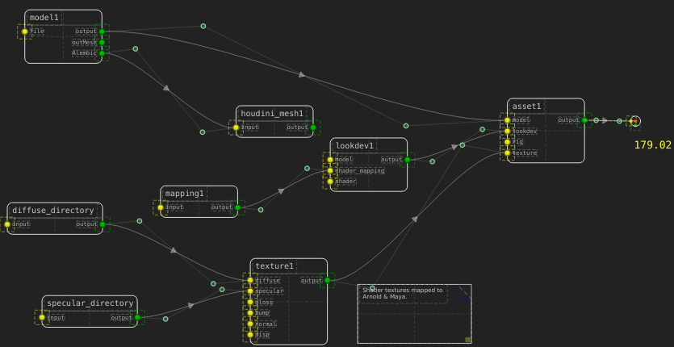
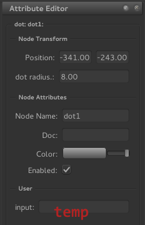

====================
Extending SceneGraph
====================

.. _node_class:

Node Classes
============

Extending SceneGraph is very easy. Custom plugins are easy to write and behave well with the builtin node types. The SceneGraph API provides distinct node classes that can be created:

- **Command (Execute):**  execute a system command or string of commands.
- **Math:** perform a math operation, ie add, subtract, multiply
- **File (Read/Write):** allows for reading, translation and writing of files.
- **Mapping:** create a mapping interface to a json file (or some other readable type)
- **Output:** display output.
- **Globals:** wrangle application (or system) globals/preferences.
- **Display:** display data of some kind. (might be grouped under **Output**)
- **Container:** defines a abstract container of some kind (ie. UDIM textures as texture channel)
- **Misc:** misc node type (ie. :ref:`DotNode`)

.. _dag_class_attrs:

Node Attributes
===============

In order for your custom nodes to be recongized, you'll need to assign certain attributes. 
DagNode attributes:

- **node_type:** how you want the node to be displayed; the "type" of node (ie. "dot", "note", "texture")
- **plugin_type:** \*

    * **core:** the node is part of the core installation and cannot be ignored.
    * **builtin:** the node resides in the **/plugins** directory.
    * **external:** the node is custom.

- **node_class:** designates the node's function or how the node is evaluated. See :ref:`node_class` above.
- **node_category:** how the node should be classified in the menus. (ie. "3d", "2d", "maya", "nuke")

\* **plugin_type** will most likely be a **PRIVATE** attribute in the near future, and be assigned by the :ref:`PluginManager`

.. _dag_common_attrs:

Common Dag Node Attributes
==========================

All nodes must have basic common attributes to work in the graph. You'll get the automatically if you subclass the default :ref:`Node` or :ref:`DagNode` types.

- **node_type (str):** type of node. **(private, required)**
- **name (str):** node name. **(required)**
- **id (str):** unique node UUID. **(private, required)**
- **color (tuple):** rgb node background color. **(required)**
- **docstring (str):** node descrition text. **(required)**
- **width (float):** node width (will auto-expand if contents are larger). **(required)** 
- **base_height (float):** the base height of the node. This is multiplied by the number of terminals on each side if the node is expanded to return the :func:`height <core.nodes.DagNode.height>` attribute.  **(required)**
- **pos (tuple):** x/y coordinates in the graph. **(required)**
- **enabled (str):** node is active (will evaluate). **(required)**
- **orientation (str):** node orientation in the graph (ie. "horizontal", "vertical"). **(required)**\**
- **style (str):** draw style (to be governed by stylesheet). **(required)**\**

\** currently not implemented.

Private/Required Attributes
---------------------------
These are attributes that are generally not editable by the user and dealt with internally. Be warned: changing the value or type of these attributes will likely corrupt your scenes and result in unstable behavior.

.. _dag_default_attrs:

Default Dag Node Attributes
===========================

Default attributes tell **SceneGraph** how to deal with new nodes.

- **default_name (str):** the root of the name a new node of this type will be given.
- **default_color (tuple):** default color of the node background.

Writing your own plugins
========================

To write your own plugins, you'll need three things:

- DagNode object file
- NodeWidget object file
- Metadata attribute description file (optional)

You'll need to subclass the default :ref:`DagNode` object type, as well as a corresponding :ref:`NodeWidget` type.

Plugin Files
------------

Place your custom plugin somewhere in the SCENEGRAPH_PLUGIN_PATH_. You'll need to subclass the core :ref:`DagNode` class, and add your functionality on top of that. Let's start with a simple node:

::

    #!/usr/bin/env python
    from SceneGraph import options
    from SceneGraph.core.nodes import DagNode

    class MyNode(DagNode):
        node_type     = 'myNode'
        node_class    = 'container'
        default_name  = 'my_node'
        default_color = [172, 172, 172, 255]

        def __init__(self, name=None, **kwargs):
            DagNode.__init__(self, name, **kwargs)

To register the node as a valid type, you'll need to add attributes for the class: **node_type** and **node_class**. Additionally, you can add a descriptor attribute **node_category**.

After that, let's create a widget plugin:

::

    #!/usr/bin/env python
    from SceneGraph.ui.node_widgets import NodeWidget

    class MyNodeWidget(NodeWidget):
        widget_type  = 'myNode'
        node_class   = 'container'
        def __init__(self, dagnode, parent=None):
            NodeWidget.__init__(self, dagnode, parent)

You'll need to make sure that the widget has an attribute **widget_type** that matches the base node type you've just created.

Metadata Description Files
--------------------------
The metadata is used to describe your node's parameters to the application. You'll need to define attributes and groups. Private attributes will not show in the UI by default. Each node will inherit all of its parent classes metadata descriptors, so you won't have to manage parent attributes unless you choose to.

::

    # dot node attributes
    [group Node Transform]

        [attr width]
            default             FLOAT     8.0
            required            BOOL      true
            private             BOOL      true   

        [attr radius]
            default             FLOAT    8.0
            label               STRING   "dot radius"
            required            BOOL     true

The above metadata is the builtin **Dot** node's description. Rendered in the **AttributeEditor**, it looks like this:

Under the **Node Transform** group, we see the **Position** attribute. That attribute is inherited from the parent :ref:`DagNode` object. If we add it to the descriptor above and set the **private** paremeter, it will no longer render in the **AttributeEditor**:

::

    # dot node attributes
    [group Node Transform]

        [attr pos]
            private             BOOL      true

        [attr width]
            default             FLOAT     8.0
            required            BOOL      true
            private             BOOL      true   

        [attr radius]
            default             FLOAT    8.0
            label               STRING   "dot radius"
            required            BOOL     true

The **group** determines which group the attributes will be grouped under. Note that the **width** attribute is not shown, while the **radius** is. Setting the **width.private** paramenter to **false** will allow the user to change it. 

Warning: exposing private :ref:`DagNode` attributes can lead to system unstability. It is strongly recommended that you do not do that.

Building Plugins
----------------

After your plugin is ready, run the utility **/bin/build_plugin** on your files to create the plugin file.

Environment Setup
=================

To extend SceneGraph, there are a few environment variables we'll need to set:

.. _SCENEGRAPH_PLUGIN_PATH:

SCENEGRAPH_PLUGIN_PATH
----------------------

  - Use this variable to extend where SceneGraph goes to look for node plugins.

SCENEGRAPH_CONFIG_PATH
----------------------

  - Use this variable to add different font and color schemes for the UI.

SCENEGRAPH_STYLESHEET_PATH
--------------------------

  - Use this variable to add different Qt stylesheets for skinning the UI.